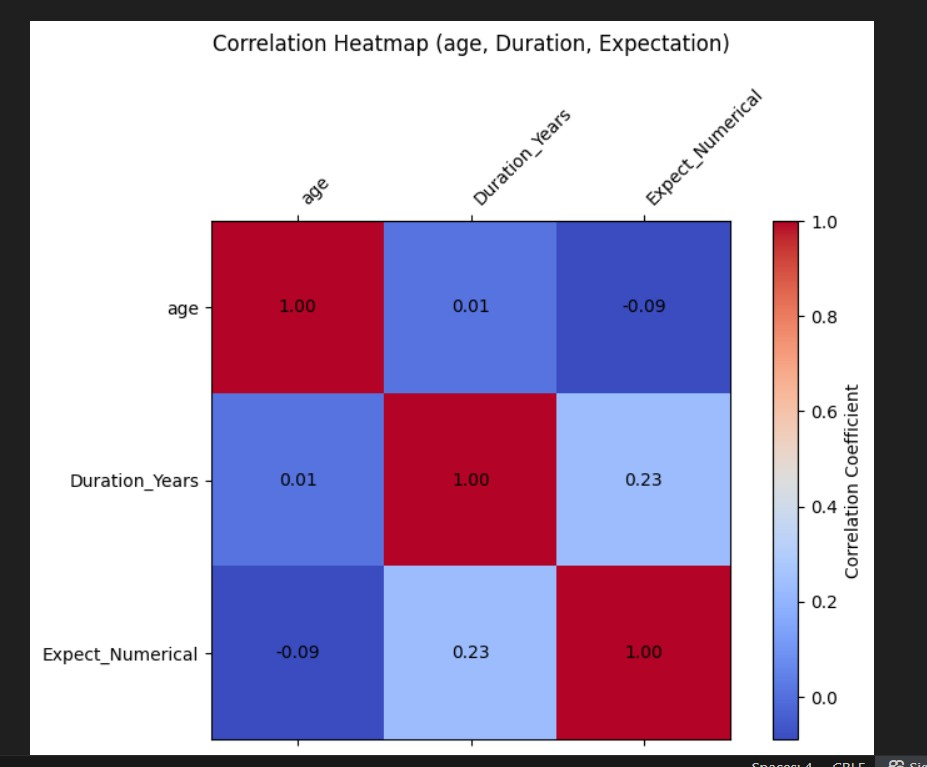
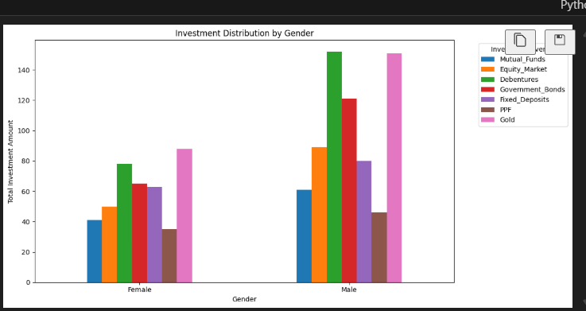

## 🧠 Overview
This project focuses on understanding investment behaviors using Python-based data analysis.  
It explores how **Age**, **Investment Duration**, and **Expectation** are related and how **investment preferences differ by gender**.  

By combining statistical insights and visualizations, the project highlights patterns that can guide smarter financial decisions.

---

## 🎯 Objectives
- Analyze correlations between **Age**, **Duration**, and **Expectation**  
- Compare **investment patterns by gender**  
- Visualize results using clear, professional charts  

---

## 🛠 Tools & Libraries Used
- 🐍 **Python 3**
- 🧮 **Pandas** – data manipulation and analysis  
- 📈 **Matplotlib** & **Seaborn** – data visualization  
- 💻 **Jupyter Notebook / Google Colab**

---

## 📊 Visual Outputs

| Visualization | Description |
|----------------|-------------|
|  | Correlation between Age, Duration, and Expectation |
|  | Gender-based Investment Distribution |

